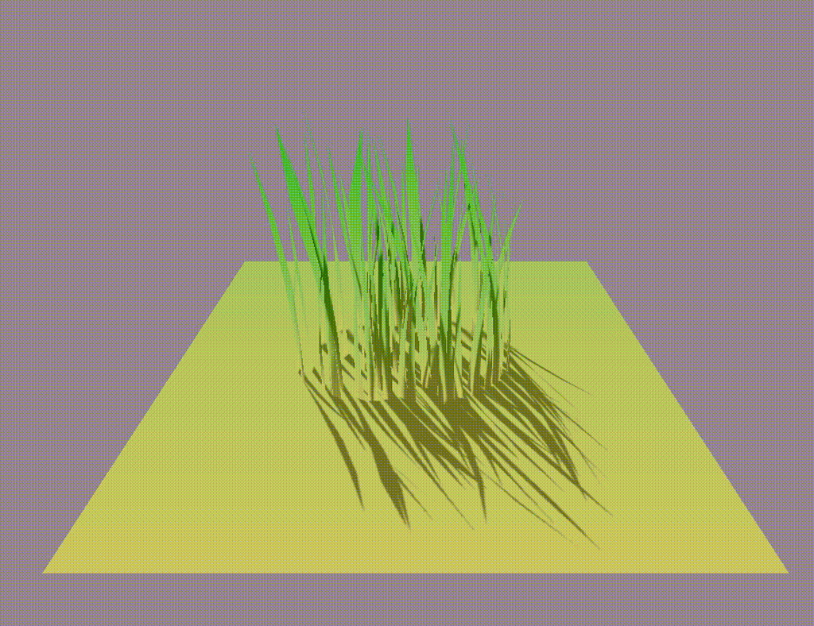

# Grass Geometry Shader for Unity

Grass shader using mesh generation and computer shader for wind swing.

Reference project:
* [Unity Grass Shader](http://roystan.net/articles/grass-shader.html).
* [Unity Grass using Shader Graph](http://youtube.com/watch?v=L_Bzcw9tqTc).

Different approach used because Geometry Shader and Shader Graph are not working correctly on MacOS.

